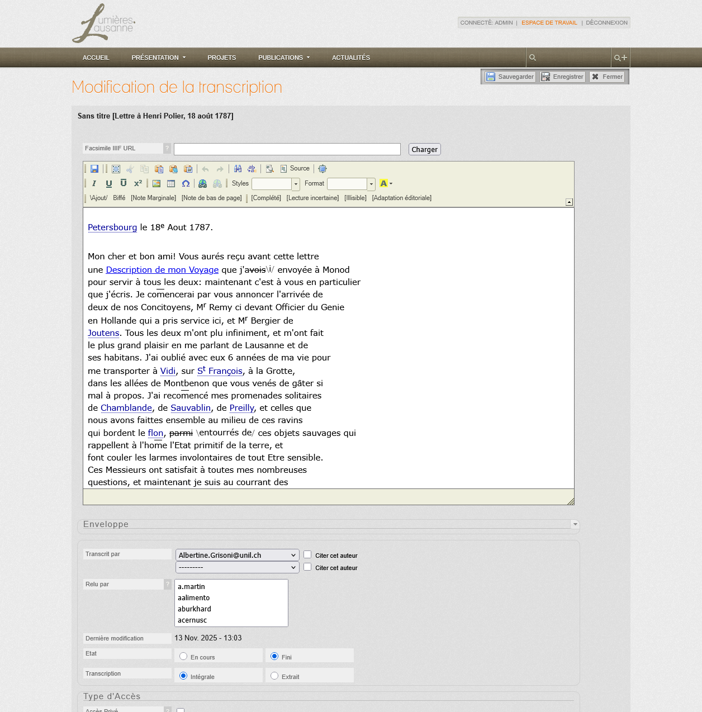
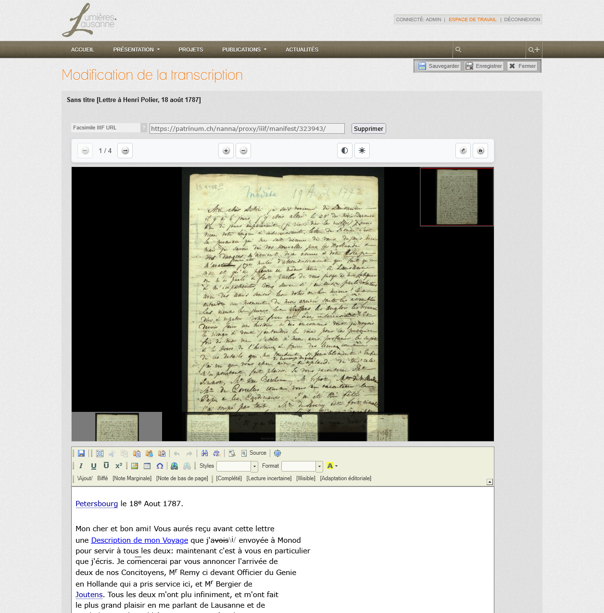
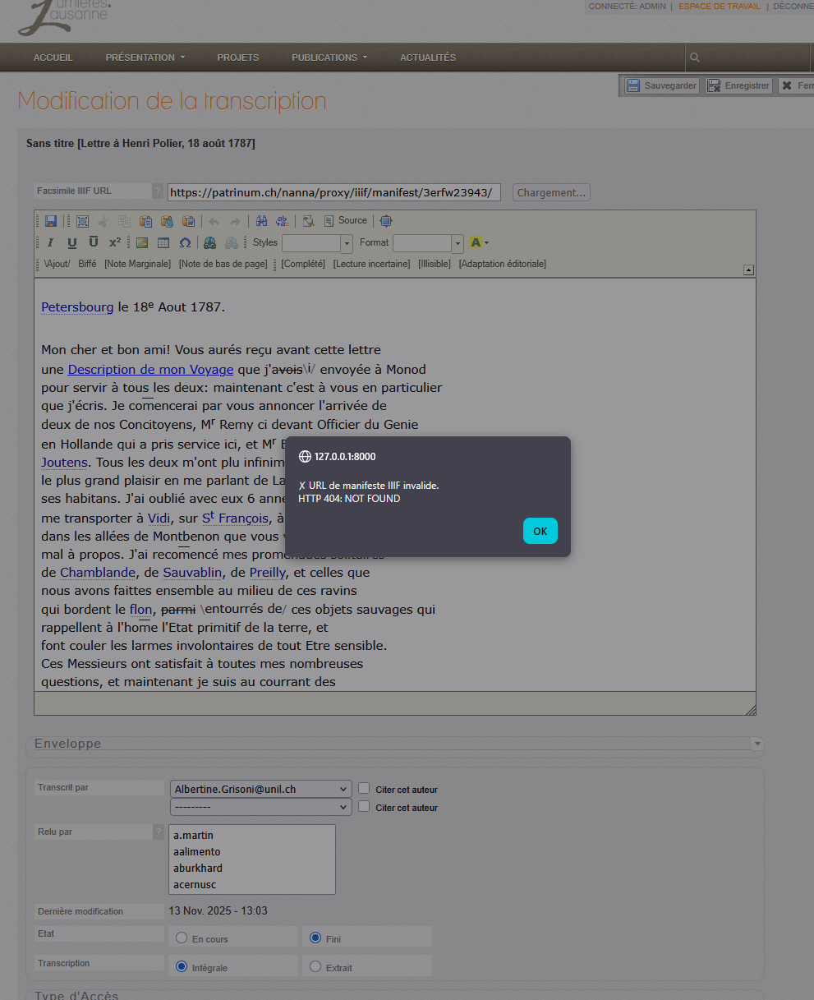

<!--
Copyright (C) 2010-2025 Université de Lausanne, RISET
<https://www.unil.ch/riset/>

This file is part of Lumières.Lausanne.
Lumières.Lausanne is free software: you can redistribute it and/or modify
it under the terms of the GNU General Public License as published by
the Free Software Foundation, either version 3 of the License, or
(at your option) any later version.

Lumières.Lausanne is distributed in the hope that it will be useful,
but WITHOUT ANY WARRANTY; without even the implied warranty of
MERCHANTABILITY or FITNESS FOR A PARTICULAR PURPOSE.  See the
GNU General Public License for more details.

You should have received a copy of the GNU General Public License
along with this program.  If not, see <https://www.gnu.org/licenses/>.

This copyright notice MUST APPEAR in all copies of the file.
-->

# Administrator Guide: IIIF Facsimile Management

> **Navigation**: [Home](../index.md) > [Administrator Guides](../index.md#administrator-guides) > Admin Guide (EN)

## Overview

This guide is intended for administrators and editors who manage transcriptions and their associated facsimiles in the Lumières.Lausanne administration interface.

**Related Documentation:**

- **[User Guide (EN)](facsimile-user-guide.md)** - End-user documentation
- **[Guide administrateur (FR)](../fr/facsimile-guide-admin.md)** - French admin guide
- **[Developer: IIIF Migration](../iiif-facsimile-migration.md)** - Technical implementation details
- **[Developer: OpenSeadragon Integration](../openseadragon-integration.md)** - Integration architecture

---

## Table of Contents

1. [Edit Interface](#edit-interface)
2. [Adding an IIIF Manifest URL](#adding-an-iiif-manifest-url)
3. [Validation and Preview](#validation-and-preview)
4. [Error Messages and Debugging](#error-messages-and-debugging)
5. [Managing Facsimiles](#managing-facsimiles)
6. [Best Practices](#best-practices)

---

## Edit Interface

The transcription edit interface includes a dedicated field for the IIIF manifest URL, located in the document metadata section.

### "Facsimile IIIF URL" Field

- **Label**: Facsimile IIIF URL
- **Type**: URL field
- **Required**: No (optional)
- **Help text**: URL of the IIIF manifest (must point to a manifest.json or info.json file)

---

## Adding an IIIF Manifest URL

### Standard Procedure

1. **Access the edit page** for the transcription
2. **Locate the field** "Facsimile IIIF URL"
3. **Enter the complete URL** of the IIIF manifest
4. **Click "Load"** to validate and preview

### Accepted URL Formats

The URL must point to a valid IIIF manifest:

**Examples of valid URLs:**
```
https://iiif.dcsr.unil.ch/iiif/2/patrinum-IG-9-81-2-007-050-recto.jp2/info.json
https://example.org/iiif/manuscript/manifest.json
https://gallica.bnf.fr/iiif/ark:/12148/btv1b8449691v/manifest.json
```

**Supported standards:**
- IIIF Presentation API v2.0
- IIIF Presentation API v3.0
- IIIF Image API v2.0
- IIIF Image API v3.0

---

## Validation and Preview

### Initial State: No Manifest



**State**: Empty field, no viewer displayed

**Behavior:**
- "Load" button is available
- No preview displayed
- Transcription will display in text-only mode on public side

### Successful Loading



**State**: URL validated, viewer active

**Behavior:**
- OpenSeadragon viewer displays in the right panel
- Zoom and navigation controls are functional
- URL field is disabled (grayed out) to prevent accidental changes
- A hidden field preserves the URL for form submission
- "Load" button transforms into "Remove"

**Controls available in preview:**
- **Zoom +/-**: Zoom in/out
- **Home**: Reset view
- **Navigator thumbnail**: Top-right corner, full page preview

### Failed Validation: 404 Error



**State**: Invalid URL or resource not found

**Error message displayed:**
```
Error loading IIIF manifest.
Please verify the URL is correct and accessible.
```

**Possible causes:**
1. **Incorrect URL**: Typo in the URL
2. **Non-existent resource**: The document doesn't exist on the IIIF server
3. **Path problem**: The path to the manifest is incorrect
4. **Inaccessible server**: The IIIF server is offline or unreachable
5. **Permission issues**: CORS access restrictions

---

## Error Messages and Debugging

### User-Facing Messages

#### Error: "IIIF manifest URL is required"

**Context**: User clicks "Load" without entering a URL

**Solution**: Enter a valid URL in the field before clicking "Load"

#### Error: "Failed to load manifest"

**Context**: HTTP request failed

**Possible causes:**
- Network problem
- IIIF server unavailable
- Timeout (time limit exceeded)

**Solution:**
1. Check Internet connection
2. Test the URL in a separate browser
3. Contact the IIIF server administrator

#### Error: "Invalid IIIF manifest format"

**Context**: The loaded file is not a valid IIIF manifest

**Possible causes:**
- URL points to a non-IIIF JSON file
- Manifest is malformed (invalid JSON)
- Unsupported IIIF version

**Solution:**
1. Verify the URL points to a real IIIF manifest
2. Test the manifest with an online IIIF validator
3. Use a manifest conforming to v2.0 or v3.0 standards

### JavaScript Console Messages

To access debug logs, open the **JavaScript Console** in your browser:
- **Chrome/Edge**: F12 > "Console" tab
- **Firefox**: F12 > "Console" tab
- **Safari**: Cmd+Option+C

#### Success Logs

```javascript
[Facsimile Viewer] Fetching IIIF manifest from: https://example.org/manifest.json
[Facsimile Viewer] Manifest loaded successfully
[Facsimile Viewer] IIIF version: 2.0
[Facsimile Viewer] Sequences found: 1
[Facsimile Viewer] Total canvases: 42
[Facsimile Viewer] OpenSeadragon viewer initialized
```

**Interpretation:**
- Manifest loaded successfully
- IIIF version detected (2.0 or 3.0)
- Number of sequences and pages (canvases) found
- OpenSeadragon viewer is initialized

#### Network Error Logs

```javascript
[Facsimile Viewer] ERROR: Failed to fetch manifest
[Facsimile Viewer] HTTP Error: 404 Not Found
[Facsimile Viewer] URL: https://example.org/nonexistent.json
```

**Interpretation:**
- HTTP 404 error: Resource doesn't exist
- Check URL and access path

```javascript
[Facsimile Viewer] ERROR: Network error
[Facsimile Viewer] CORS policy blocked the request
```

**Interpretation:**
- CORS problem: IIIF server doesn't allow cross-origin requests
- **Solution**: Configure CORS headers on the IIIF server

#### Parsing Error Logs

```javascript
[Facsimile Viewer] ERROR: Invalid JSON in manifest
[Facsimile Viewer] SyntaxError: Unexpected token < in JSON at position 0
```

**Interpretation:**
- Returned file is not valid JSON
- Can happen if URL points to an HTML error page

```javascript
[Facsimile Viewer] ERROR: Missing required IIIF properties
[Facsimile Viewer] Expected 'sequences' or 'items' not found
```

**Interpretation:**
- JSON is valid but doesn't contain required IIIF properties
- Manifest doesn't conform to IIIF standard

#### OpenSeadragon Error Logs

```javascript
[OpenSeadragon] ERROR: Unable to load tile source
[OpenSeadragon] Invalid tile source format
```

**Interpretation:**
- Viewer cannot load image tiles
- Problem with IIIF image service or tile URLs

```javascript
[OpenSeadragon] WARN: Viewer container not found
[OpenSeadragon] Element ID: facsimile-viewer
```

**Interpretation:**
- Initialization problem: HTML container doesn't exist
- Verify `<div id="facsimile-viewer">` element is present in the page

### Django Logs (Server-Side)

Server-side validations generate logs in Django log files.

**Log location**: According to `settings.py` configuration

#### Successful Validation

```
[INFO] Validating IIIF manifest: https://example.org/manifest.json
[INFO] Manifest validation successful
[INFO] IIIF version: 2.1.1
```

#### Validation Errors

```
[ERROR] Failed to fetch IIIF manifest
[ERROR] URL: https://example.org/manifest.json
[ERROR] HTTPError: 404 Client Error: Not Found
```

```
[ERROR] Invalid IIIF manifest format
[ERROR] Missing required field: sequences
[ERROR] URL: https://example.org/manifest.json
```

```
[ERROR] Timeout while fetching manifest
[ERROR] URL: https://example.org/slow-server.com/manifest.json
[ERROR] Timeout: 10 seconds exceeded
```

**Timeout configuration:**
By default, timeout is 10 seconds (configurable in `forms.py`)

---

## Managing Facsimiles

### Modifying an Existing URL

To modify an already saved facsimile URL:

1. **Click "Remove"** to disable the viewer
2. URL field becomes editable again
3. **Modify the URL** or delete it completely
4. **Click "Load"** to validate the new URL
5. **Save** the form

### Removing a Facsimile

To completely remove a facsimile from a transcription:

1. **Click "Remove"** if the viewer is loaded
2. **Clear the URL field** completely
3. **Save** the form
4. Transcription will display in text-only mode on public side

### Form Submission

**Important:** Even if the URL field is disabled (grayed out) after loading, the URL is preserved during submission thanks to a hidden field.

**Verification:**
- After saving, reload the edit page
- URL should appear in the field and viewer should load automatically

---

## Best Practices

### Recommended IIIF Sources

**Trusted IIIF servers:**
- UNIL IIIF server: `iiif.dcsr.unil.ch`
- Gallica (BnF): `gallica.bnf.fr/iiif`
- Internet Archive: `iiif.archivelab.org`
- Swiss Digital Library: `iiif.e-codices.ch`

### Verification Before Adding

Before adding a manifest URL:

1. **Test URL in browser**: Should return valid JSON
2. **Verify with IIIF validator**: [IIIF Validator](https://presentation-validator.iiif.io/)
3. **Test in Mirador or Universal Viewer**: Online IIIF viewers for testing

### Naming and Organization

**Suggested conventions:**
- Use stable URLs (permalinks)
- Prefer HTTPS over HTTP
- Document manifest source in internal notes

### Performance and Optimization

**Recommendations:**
- Use performant IIIF servers (response < 2 seconds)
- Prefer well-structured manifests with complete metadata
- Avoid manifests with too many pages (> 500) if possible

### Accessibility

**Points to check:**
- Does the manifest contain descriptive metadata?
- Do images have sufficient resolution (min. 300 DPI)?
- Is the IIIF server reliable and available 24/7?

---

## Advanced Debugging

### Manual Testing of IIIF Manifest

**Steps:**

1. **Copy manifest URL**
2. **Open new tab** and paste URL
3. **Check JSON response**:
   - Must be valid JSON
   - Must contain `@context` with IIIF URL
   - Must contain `sequences` (v2.x) or `items` (v3.x)

**Example of valid manifest (v2.1):**
```json
{
  "@context": "http://iiif.io/api/presentation/2/context.json",
  "@id": "https://example.org/iiif/book1/manifest",
  "@type": "sc:Manifest",
  "label": "Book 1",
  "sequences": [
    {
      "@type": "sc:Sequence",
      "canvases": [
        {
          "@id": "https://example.org/iiif/book1/canvas/p1",
          "@type": "sc:Canvas",
          "images": [...]
        }
      ]
    }
  ]
}
```

### Validation with External Tools

**IIIF Presentation Validator:**
- URL: https://presentation-validator.iiif.io/
- Copy/paste manifest URL
- Check errors and warnings

**Mirador Viewer:**
- URL: https://projectmirador.org/
- Load manifest to test display
- Verify images load correctly

### CORS Issues

**Symptom:** Console message
```
Access to fetch at 'https://example.org/manifest.json' from origin 'https://lumieres-lausanne.ch' 
has been blocked by CORS policy
```

**Server-side solution:**
Server must return the following headers:
```
Access-Control-Allow-Origin: *
Access-Control-Allow-Methods: GET
Access-Control-Allow-Headers: Content-Type
```

**Temporary solution:**
- Contact IIIF server administrator
- Use CORS proxy (for testing only)

### Network Inspection

**In Chrome/Firefox DevTools:**

1. Open **F12 > Network** tab
2. Click "Load" to trigger request
3. Observe request to IIIF manifest:
   - **Status**: Should be `200 OK`
   - **Type**: Should be `application/json`
   - **Size**: Verify file is not empty
4. Click request to see:
   - **Headers**: Check CORS headers
   - **Preview**: See formatted JSON
   - **Response**: See raw JSON

---

## Specific Troubleshooting

### Viewer Loads in Edit but Not in Public Display

**Possible causes:**
1. Template context doesn't include URL
2. JavaScript error on display page
3. Static files not loaded (OpenSeadragon missing)

**Diagnosis:**
- Check JavaScript console on public page
- Verify `trans.facsimile_iiif_url` is passed to template
- Verify `openseadragon.min.js` is loaded

### Field Remains Grayed Out After Removal

**Cause:** JavaScript state not reset

**Solution:**
1. Full page refresh (F5)
2. If problem persists, clear browser cache

### Changes Not Being Saved

**Checks:**
1. Was form submitted ("Save" button clicked)?
2. Are there validation errors on other fields?
3. Check Django logs for save errors

---

## Technical Reference

### System Architecture

**Components:**
- **Backend (Django)**: Server-side IIIF manifest validation
- **Frontend (JavaScript)**: Client-side validation and viewer initialization
- **OpenSeadragon**: Deep Zoom visualization library
- **IIIF Server**: Image and manifest hosting

**Data flow:**
1. Admin enters URL → JavaScript validation (client)
2. AJAX request to IIIF manifest → JSON parsing
3. If valid → OpenSeadragon initialization
4. Form submission → Django validation (server)
5. Database save
6. Public display → Manifest loading → Viewer display

### Affected Files

**Backend:**
- `app/fiches/models/documents/document.py`: Transcription model
- `app/fiches/forms.py`: TranscriptionForm with validation
- `app/fiches/migrations/0009_add_facsimile_iiif_url.py`: Database migration

**Frontend:**
- `app/fiches/templates/fiches/edition/transcription.html`: Admin interface
- `app/fiches/templates/fiches/display/transcription.html`: Public interface
- `app/fiches/static/fiches/js/transcription-sync.js`: Page synchronization
- `app/static/js/lib/openseadragon/openseadragon.min.js`: OpenSeadragon library

**CSS:**
- `app/fiches/static/fiches/css/transcription.css`: Viewer styles
- `app/fiches/static/fiches/css/display_base.css`: General styles

---

## External Resources

### IIIF Documentation

- **IIIF Presentation API**: https://iiif.io/api/presentation/
- **IIIF Image API**: https://iiif.io/api/image/
- **Awesome IIIF**: https://github.com/IIIF/awesome-iiif

### Validation Tools

- **IIIF Validator**: https://presentation-validator.iiif.io/
- **JSON Validator**: https://jsonlint.com/

### Reference IIIF Viewers

- **Mirador**: https://projectmirador.org/
- **Universal Viewer**: https://universalviewer.io/
- **OpenSeadragon**: https://openseadragon.github.io/

---

## Support and Contact

In case of persistent issues:

1. **Check logs** (JS console + Django logs)
2. **Test manifest** with validation tools
3. **Review technical documentation** of the project
4. **Contact technical team** RISET, UNIL

---

**Last Updated**: November 13, 2025  
**Branch**: `feat/facsimile-viewer`
