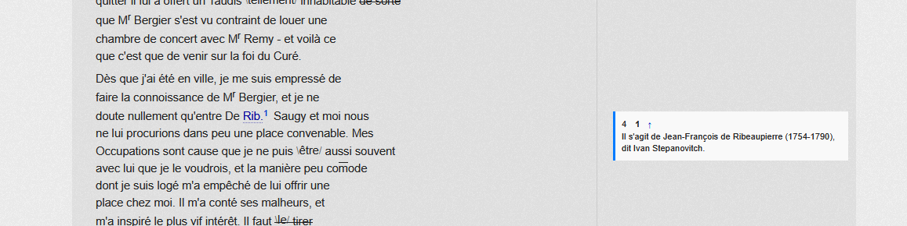
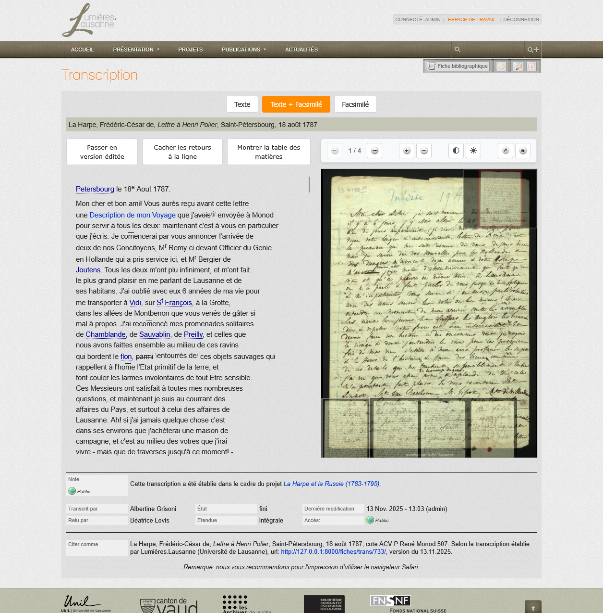
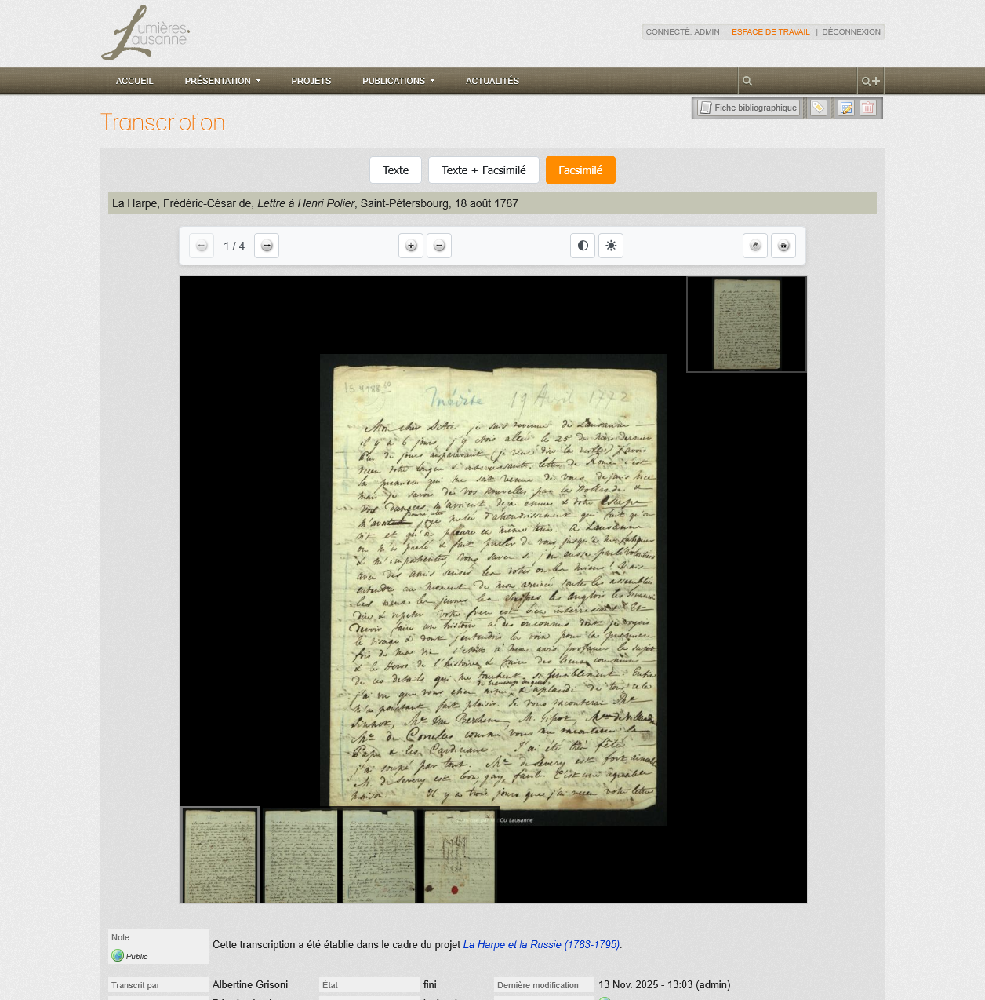

<!--
Copyright (C) 2010-2025 Université de Lausanne, RISET
<https://www.unil.ch/riset/>

This file is part of Lumières.Lausanne.
Lumières.Lausanne is free software: you can redistribute it and/or modify
it under the terms of the GNU General Public License as published by
the Free Software Foundation, either version 3 of the License, or
(at your option) any later version.

Lumières.Lausanne is distributed in the hope that it will be useful,
but WITHOUT ANY WARRANTY; without even the implied warranty of
MERCHANTABILITY or FITNESS FOR A PARTICULAR PURPOSE.  See the
GNU General Public License for more details.

You should have received a copy of the GNU General Public License
along with this program.  If not, see <https://www.gnu.org/licenses/>.

This copyright notice MUST APPEAR in all copies of the file.
-->

# Facsimile Viewer User Guide

> **Navigation**: [Home](../index.md) > [User Guides](../index.md#user-guides) > User Guide (EN)

## Overview

This guide explains how to use the IIIF facsimile viewer in Lumières.Lausanne to view transcriptions alongside their original source images.

**Related Documentation:**

- **[Administrator Guide (EN)](facsimile-admin-guide.md)** - Complete guide for administrators
- **[Guide utilisateur (FR)](../fr/facsimile-guide-utilisateur.md)** - French user guide
- **[Facsimile Usage Guide](../facsimile-usage-guide.md)** - Complete usage guide with all details

---

## Table of Contents

1. [Display Modes](#display-modes)
2. [Using the Viewer](#using-the-viewer)
3. [Navigating Facsimiles](#navigating-facsimiles)
4. [Troubleshooting](#troubleshooting)

---

## Display Modes

At the top of each transcription page, you'll find three toggle buttons to switch between display modes:

- **📄 Text only**: Display transcription only
- **📄🖼️ Text + Facsimile**: Side-by-side view with transcription and facsimile
- **🖼️ Facsimile only**: Full-width facsimile viewer

### Text-Only Mode

**When to use:**
- For comfortable reading of the transcription
- To search within the text
- To copy text content
- On small screens

**Features:**
- Text occupies full page width
- Marginal notes displayed inline
- Better readability for continuous reading

### Text + Facsimile Mode (Split View)

**When to use:**
- To compare transcription with the original
- To verify difficult-to-decipher passages
- To study the original layout

**Features:**
- Transcription appears on the left (60% width)
- Facsimile viewer appears on the right (40% width)
- Viewer remains visible while scrolling through text
- Independent facsimile navigation (zoom, pan)

### Facsimile-Only Mode

**When to use:**
- To examine the source document in detail
- To study visual elements (illustrations, ornaments)
- To zoom in significantly and see fine details

**Features:**
- Viewer occupies full page width
- Maximum zoom capability for all details
- Ideal for paleographic or codicological examination

---

## Using the Viewer

### Available Controls

The OpenSeadragon viewer offers multiple navigation methods:

#### Zoom

- **Mouse wheel**: Scroll to zoom in/out
- **+ and - buttons**: Click to zoom in/out progressively
- **Double-click**: Zoom in on a specific point

#### Panning

- **Click and drag**: Hold mouse button and move to pan the image

#### Other Controls

- **🏠 Home button**: Reset zoom and position to default
- **Navigation thumbnail**: Top-right corner, shows currently visible area

### Advanced Features

#### Progressive Zoom (Deep Zoom)

The viewer progressively loads higher resolution images as you zoom in. You can:
- Zoom in to see the finest document details
- Observe paper watermarks
- Examine ink and handwriting details

---

## Navigating Facsimiles

### Multi-Page Documents

When the document contains multiple pages:

1. Page numbers in the transcription are clickable
2. Clicking a page number automatically loads the corresponding image
3. The viewer synchronizes with your position in the text

### Navigation Thumbnail

The small thumbnail in the top-right corner of the viewer:
- Shows the entire page
- Indicates the currently visible area (red rectangle)
- Allows quick navigation by clicking on an area

---

## Troubleshooting

### Facsimile Not Displaying

**Possible causes:**
- No image associated with this transcription
- Network connection problem
- Image server temporarily unavailable

**Solutions:**
1. Check your Internet connection
2. Refresh the page (F5)
3. Try switching to text-only mode then back to facsimile mode

### Image is Blurry

**Cause:** High-resolution images are loading

**Solutions:**
- Wait a few seconds for loading to complete
- On a slow connection, loading may take longer
- High-resolution tiles load progressively

### Controls Not Working

**Solutions:**
1. Refresh the page
2. Verify JavaScript is enabled in your browser
3. Try another browser (Chrome, Firefox, Safari, Edge)

---

## Usage Tips

### For Reading

- Use **text-only mode** for smooth reading
- Switch to **split mode** to verify difficult passages
- Adjust browser text size if needed (Ctrl/Cmd + or -)

### For Research

- **Text-only mode** enables browser search (Ctrl/Cmd + F)
- Use **split mode** to locate passages in the original
- Page numbers facilitate citations and references

### For In-Depth Study

- **Facsimile-only mode** offers the best view for visual analysis
- Zoom to maximum to examine paleographic details

---

## Browser Compatibility

The viewer works on:

- ✅ **Chrome/Chromium** (recent version)
- ✅ **Firefox** (recent version)
- ✅ **Safari** (recent version)
- ✅ **Edge** (recent version)

Older browsers (Internet Explorer 11 and earlier) are not supported.

---

## Accessibility

- All controls are keyboard accessible
- Images can be enlarged for visually impaired users
- Text-only mode enables screen reader use
- Contrasts are optimized for readability

---

**Last Updated**: November 13, 2025
