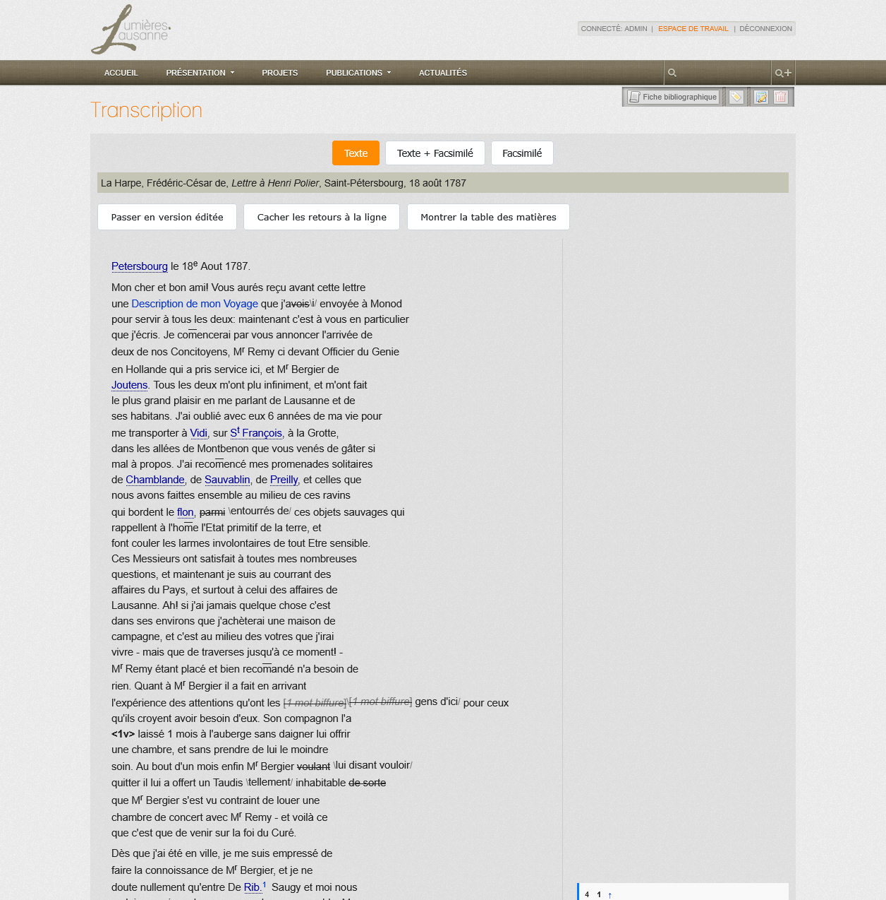

<!--
Copyright (C) 2010-2025 Université de Lausanne, RISET
<https://www.unil.ch/riset/>

This file is part of Lumières.Lausanne.
Lumières.Lausanne is free software: you can redistribute it and/or modify
it under the terms of the GNU General Public License as published by
the Free Software Foundation, either version 3 of the License, or
(at your option) any later version.

Lumières.Lausanne is distributed in the hope that it will be useful,
but WITHOUT ANY WARRANTY; without even the implied warranty of
MERCHANTABILITY or FITNESS FOR A PARTICULAR PURPOSE.  See the
GNU General Public License for more details.

You should have received a copy of the GNU General Public License
along with this program.  If not, see <https://www.gnu.org/licenses/>.

This copyright notice MUST APPEAR in all copies of the file.
-->

# Facsimile Viewer Usage Guide

## Overview

This guide explains how to use the IIIF facsimile viewer functionality in Lumières.Lausanne, both for editing transcriptions in the admin interface and for displaying them to end users.

## Table of Contents

1. [Admin Interface: Editing Facsimile URLs](#admin-interface-editing-facsimile-urls)
2. [Display Interface: Viewing Facsimiles](#display-interface-viewing-facsimiles)
3. [Layout Modes](#layout-modes)
4. [Troubleshooting](#troubleshooting)

---

## Admin Interface: Editing Facsimile URLs

The admin interface allows editors to add IIIF manifest URLs to transcriptions and preview the facsimile viewer before saving.

### Adding a Facsimile URL

1. Navigate to the transcription edition page in the admin interface
2. Locate the **"Facsimile IIIF URL"** field
3. Enter a valid IIIF manifest URL (must point to a manifest.json or info.json file)
4. Click the **"Charger"** (Load) button to validate and preview the facsimile

### Field Validation

The system validates the IIIF URL both client-side and server-side:

- **Valid URL**: When a valid IIIF manifest is provided, the viewer loads successfully and displays the facsimile with zoom and navigation controls
- **Invalid URL**: Error messages are displayed if the URL is malformed or unreachable

#### Common Validation Scenarios

##### No Manifest Provided

When the field is empty, no viewer is loaded and the transcription will display in text-only mode.

##### Invalid or Unreachable URL (404 Error)

If the IIIF manifest URL returns a 404 error or is otherwise unreachable, the system displays an error message. Common causes:
- Incorrect URL path
- Resource not available on the IIIF server
- Network connectivity issues
- CORS restrictions

##### Successfully Loaded Manifest

When a valid IIIF manifest is loaded:
- The OpenSeadragon viewer appears in the right panel
- Zoom controls (+/-) are available
- The navigator (thumbnail preview) appears in the top-right corner
- The input field is disabled to prevent accidental modification
- A hidden field preserves the URL for form submission

### Saving Changes

1. Once the facsimile loads successfully, the URL is automatically preserved
2. Click **"Save"** or **"Save and continue editing"** to persist the changes
3. The facsimile will now appear on the public transcription page (if display is enabled)

### Removing a Facsimile

1. Click the **"Supprimer"** (Remove) button next to the URL field
2. The viewer is destroyed and the URL field is cleared
3. Save the form to remove the facsimile from the transcription

---

## Display Interface: Viewing Facsimiles

The public display interface provides multiple layout modes for viewing transcriptions with or without facsimiles.

### Layout Mode Controls

Located at the top of the transcription page, three toggle buttons allow users to switch between display modes:

- **Text only** (📄): Display only the transcription text
- **Text + Facsimile** (📄🖼️): Side-by-side view with transcription and facsimile
- **Facsimile only** (🖼️): Full-width facsimile viewer

### Text-Only Mode

In text-only mode:
- The transcription occupies the full width of the content area
- Marginal notes and side notes are displayed inline
- The facsimile viewer is hidden
- This mode is ideal for reading and text analysis
- This is the default mode when no IIIF manifest URL is provided

### Text + Facsimile Mode (Split View)

In split view mode:
- The transcription appears on the left (60% width)
- The facsimile viewer appears on the right (40% width)
- The viewer is sticky, remaining visible while scrolling through the text
- Users can zoom and navigate the facsimile independently
- Navigation controls include:
  - Zoom in/out buttons
  - Home button (reset zoom)
  - Navigator thumbnail (top-right corner)

### Text-Only Mode (with Facsimile Available)

When a facsimile is available but text-only mode is selected:
- Only the transcription is displayed
- The facsimile viewer is hidden
- Users can toggle to view the facsimile at any time using the mode buttons

### Facsimile-Only Mode

In facsimile-only mode:
- The viewer occupies the full width of the content area
- The transcription text is hidden
- All viewer controls remain available
- This mode is ideal for examining the source document in detail
- Users can zoom to high magnification to see fine details

### Viewer Features

The OpenSeadragon viewer provides:

- **Zoom controls**: Mouse wheel or +/- buttons
- **Pan**: Click and drag to move around the image
- **Navigator**: Mini-thumbnail in the top-right showing the current viewport
- **Home button**: Reset zoom and pan to the default view
- **Deep zoom**: Progressive loading of higher resolution tiles as you zoom in

### Page Synchronization

When available in the IIIF manifest, the viewer can display multiple pages:
- Page numbers in the transcription are synchronized with the facsimile
- Clicking on a page number in the text navigates to the corresponding image
- The viewer automatically loads the correct page when scrolling

---

## Layout Modes

### Mode Persistence

The selected layout mode is saved to the user's session or browser local storage, so the preference is maintained across page views and visits.

### Responsive Behavior

On smaller screens (< 1200px width):
- The split view automatically stacks vertically
- The facsimile appears above the transcription
- All controls remain accessible

### Default Mode

- If no IIIF manifest URL is provided: **Text-only mode** (facsimile buttons are hidden)
- If a manifest URL exists: **Text + Facsimile mode** (split view)

---

## Troubleshooting

### Common Issues

#### Facsimile Not Loading

**Symptoms**: Viewer panel is empty or shows an error message

**Solutions**:
1. Verify the IIIF manifest URL is correct and accessible
2. Check browser console for CORS errors
3. Ensure the IIIF server is online and responding
4. Try loading the manifest URL directly in a browser to verify it returns valid JSON

#### Viewer Controls Not Working

**Symptoms**: Cannot zoom, pan, or navigate

**Solutions**:
1. Refresh the page to reinitialize the viewer
2. Check that JavaScript is enabled in the browser
3. Verify OpenSeadragon library is loaded (check browser console for errors)
4. Try a different browser to rule out compatibility issues

#### Layout Issues

**Symptoms**: Overlapping content, missing panels, or incorrect sizing

**Solutions**:
1. Clear browser cache and reload
2. Verify CSS files are loaded correctly
3. Check browser zoom level (should be 100%)
4. Resize the browser window to trigger responsive layout recalculation

#### Image Quality Poor

**Symptoms**: Blurry or pixelated images even when zoomed out

**Solutions**:
1. Verify the IIIF manifest points to high-resolution source images
2. Check network connectivity (slow connections may prevent high-res tiles from loading)
3. Wait for progressive loading to complete (higher resolution tiles load gradually)

### Error Messages

| Error Message | Cause | Solution |
|--------------|-------|----------|
| "IIIF manifest URL is required" | Empty URL field when trying to load | Enter a valid manifest URL |
| "Failed to load manifest" | Network error or invalid URL | Check URL and network connectivity |
| "Invalid IIIF manifest format" | Malformed JSON or non-IIIF format | Verify the URL points to a valid IIIF manifest |
| "404 Not Found" | Resource doesn't exist | Check the URL path and server availability |

### Browser Compatibility

The facsimile viewer is tested and supported on:

- **Chrome/Chromium** (latest)
- **Firefox** (latest)
- **Safari** (latest)
- **Edge** (latest)

Older browsers (IE11 and below) are not supported.

---

## Technical Details

### IIIF Standards

The viewer supports:
- **IIIF Presentation API** v2.0 and v3.0
- **IIIF Image API** v2.0 and v3.0

### Supported Manifest Formats

- IIIF Manifest (manifest.json)
- IIIF Image Information (info.json)
- Inline tile sources

### Performance Considerations

- Manifests with many pages (>100) may have slower initial load times
- High-resolution images benefit from Deep Zoom tiling
- Viewer initialization is optimized to load only visible tiles
- Progressive enhancement ensures the transcription is usable even if the viewer fails to load

---

## Related Documentation

- [IIIF Facsimile Viewer Migration](iiif-facsimile-migration.md) - Technical migration details
- [OpenSeadragon Integration](openseadragon-integration.md) - Integration architecture and next steps
- [IIIF Presentation API Specification](https://iiif.io/api/presentation/) - External reference

---

## Changelog

### Branch: `feat/facsimile-viewer`

- **2025-01**: Initial IIIF facsimile viewer implementation
  - Added `facsimile_iiif_url` field to Transcription model
  - Implemented OpenSeadragon integration
  - Added layout mode toggles (text/split/viewer)
  - Added page synchronization between text and images
  - Implemented form validation for IIIF manifest URLs
  - Added responsive layout
  - Created comprehensive user documentation

---

**Last Updated**: November 13, 2025
